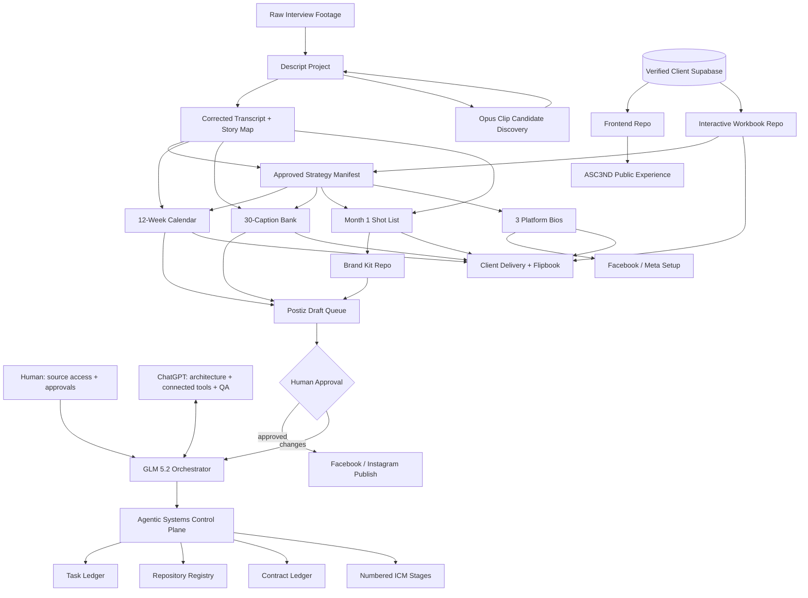
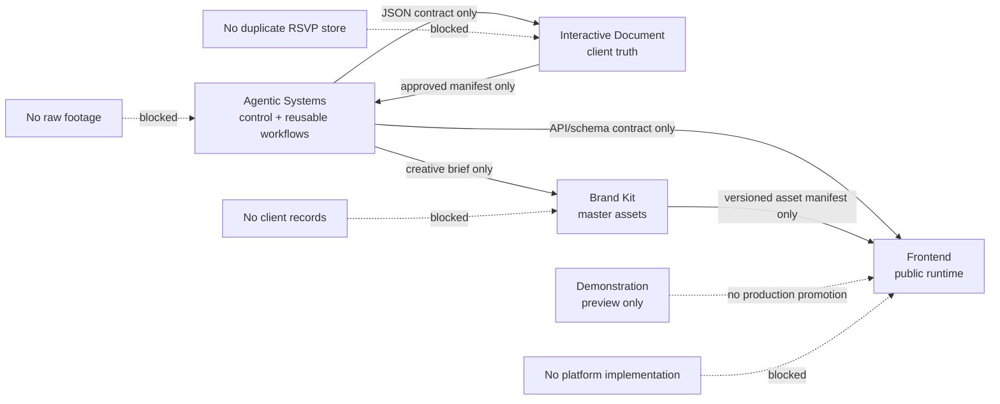
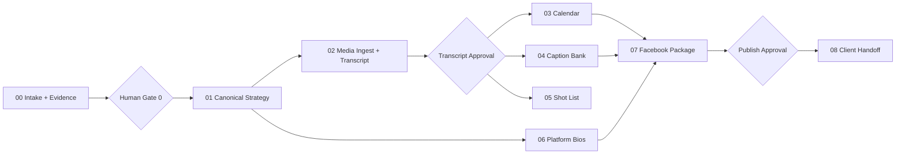

# ASC3ND Contract Closeout Architecture

## System graph

## Repository collision barriers

## ICM execution stages

## Parallel work law

Parallel work is permitted only when outputs do not overlap:

- Calendar, transcript QA, shot-list formatting, and platform-bio drafting may run in parallel after the strategy manifest is frozen.
- One writer owns one file path.
- Every worker writes a result manifest before the orchestrator merges conclusions.
- No worker directly changes production, sends external messages, or publishes.

## Media tool split

- **Descript:** canonical transcript, speaker labels, editorial timeline, caption correction, master compositions, final exports.
- **Opus Clip:** candidate discovery and hook ranking only unless its output is manually verified. It must not become the source of truth for quotes, captions, names, or story meaning.
- **Postiz:** approved draft scheduling and publishing after human approval.

## Data truth

The currently connected Supabase account exposes only `botanic-creations`. It is not verified as the ASC3ND client database. Agents must not write ASC3ND data there. The correct client project must be connected and inventoried before any migration or operational query.