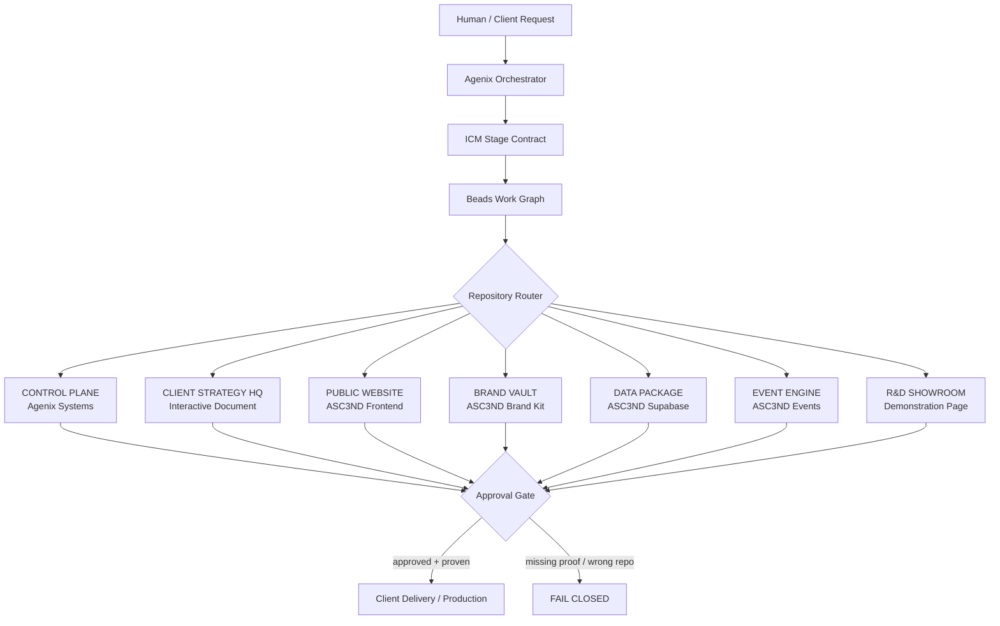

# Agenix Strict Architecture — One Repo, One Responsibility

## Slide statement

**Global discipline by default. Agents do not decide where work belongs; policy decides.**



## Laws

1. **Default deny.** If a role or repository is not explicitly allowed to perform an action, it may not perform it.
2. **One repository, one bounded responsibility.** No repo becomes a dumping ground.
3. **One writer per output path.** Parallel agents may review, not collide.
4. **Cross-repo work requires a handoff artifact.** No direct opportunistic writes across boundaries.
5. **Writer cannot self-approve yellow/red work.** Review is independent.
6. **Client truth, brand truth, runtime truth, data truth, and studio truth are separate domains.**
7. **Production is approval-gated.** Publishing, deploys, DNS, migrations, secrets, deletions, and destructive actions require recorded human approval.
8. **Beads records movement. ICM controls context. Evidence controls completion.**
9. **Wrong-repo request stops automatically.** Required response: `REPOSITORY_BOUNDARY_STOP`.
10. **Bonuses never displace paid scope.** Contract-critical work remains the priority queue.

## Repository security zones

| Zone | Repository | Role | May write | Must not contain |
|---|---|---|---|---|
| Studio | `ascend-social-purpose-agentic-systems-` | Orchestration | ICM, Beads, approvals, adapters, proof | production website, brand masters, raw private records |
| Client HQ | `asce3nd-interactive-document` | Strategy truth | workbook, strategy, client approvals, handoff | production runtime, shared studio code |
| Web | `asc3nd-frontend-website-` | Public runtime | public ASC3ND website | studio orchestration, design experiments, duplicate DB |
| Brand | `asc3nd-brand-kit-` | Creative truth | SVGs, QR, templates, campaign masters | app logic, DB records, publishing engine |
| Data | `asc3nd-supabase-landing` | Data contract | migrations, RLS, schema docs, backup/runbooks | competing landing page, brand experimentation |
| Events | `asc3nd-events-page` | Event product | event microsites and RSVP UX | main-site ownership, studio logic |
| Lab | `ascend-demonstration-page` | R&D only | prototypes and alternate concepts | production truth, live client data, production DNS |

## Agent role model

```text
ORCHESTRATOR  -> routes, reconciles, requests approval
STRATEGY      -> client strategy repo only
BRAND         -> brand vault only
WEBSITE       -> production website repo only
EVENT         -> event engine only
DATA          -> data package only
PUBLISHING    -> control plane adapters only
REVIEW        -> reads everything, writes no production change
HUMAN         -> final yellow/red approval
```

## Completion chain

`REQUEST -> ICM -> BEAD -> ROLE -> OWNER REPO -> OUTPUT -> REVIEW -> EVIDENCE -> APPROVAL -> DELIVERY`

Any broken link means **not done**.
