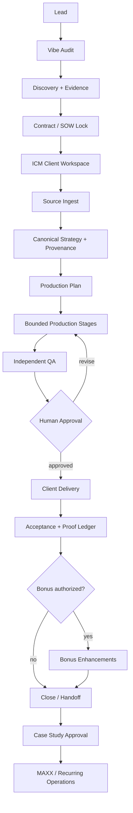

# Agenix Studio Architecture v1

## Decision

This repository becomes the reusable operating system for the studio. The repository name stays unchanged for now, but the product concept is **Agenix Systems / Agenix Studio**.

ASC3ND is the first live client implementation, not the architecture itself.

The studio must be able to onboard a future client by creating one isolated ICM tenant workspace, attaching a contract, loading approved client context, routing work through bounded stages, collecting proof, delivering the paid scope, then optionally activating bonus systems and recurring operations.

## Operating laws

1. Paid scope before bonus work.
2. Client truth and reusable platform code stay separate.
3. One stage, one job.
4. Deterministic code owns sequencing, retries, validation, file movement, and checks when judgment is not required.
5. Agents own bounded judgment tasks inside a stage.
6. Every stage has explicit inputs, outputs, acceptance criteria, and proof.
7. A builder cannot approve its own work.
8. Publishing, production deploys, credentials, money movement, youth/sensitive data, and irreversible actions require human approval.
9. Client-facing workflows must hide technical complexity. A nontechnical client should mainly see: Review -> Approve -> Scheduled/Delivered.
10. No deliverable is complete until a client-ready artifact and evidence record exist.

## Source principles incorporated

### ICM

Use the existing five-layer model:

- Layer 0: agent identity and global guardrails
- Layer 1: workspace routing
- Layer 2: stage contract
- Layer 3: stable references, brand, policies, skills, conventions
- Layer 4: working artifacts for the current engagement/run

The folder system remains the human-readable orchestration layer. Do not replace it with a hidden swarm.

### Super Simple Software Factory

Adopt the control-plane principle: **agent proposes, code disposes**.

- Python/TypeScript scripts should own deterministic sequencing, acceptance, retries, tests, status transitions, and trace writes.
- Agents execute named bounded phases requiring reading and judgment.
- Typed JSON envelopes carry results between automation boundaries.
- Runs should be observable and replayable.

This complements ICM rather than replacing it: ICM defines context and edit surfaces; deterministic runners execute repeatable stage transitions.

### Printing Press pattern

Use generated, machine-legible interfaces for integrations and recurring external operations where practical:

- dry-run first
- JSON output mode
- doctor/status commands
- explicit learn/confirm/forget boundaries
- supply-chain and secret checks before installing generated tooling

Do not import the entire printing-press repository into this codebase. Extract the interface pattern and only add generated CLIs when an external service needs a durable operator surface.

### Agent-business deployment pattern

A client agent may eventually have its own computer, inbox, communication channel, tools/connectors, knowledge layer, and observability, but these are **activation options**, not mandatory Day-1 complexity.

Start with one useful workflow. Add capabilities only after a verified need appears.

## Canonical studio graph



## Repository roles

Existing repository boundaries stay authoritative. This repository owns reusable orchestration, approvals, contracts, schemas, adapters, ICM routing, observability, and studio policy.

Client-specific public sites, brand masters, media originals, and specialized apps remain in their designated repositories and connect through manifests and evidence records.

## Canonical client workspace

The existing path remains the implementation path for backward compatibility:

`icm/tenants/<client-slug>/`

For studio language, **tenant = client workspace**.

Recommended client workspace shape:

```text
icm/tenants/<client>/
  AGENT.md
  CONTEXT.md
  CLIENT.md
  _config/
    brand.md
    voice.md
    privacy.md
    approvals.md
    ownership.md
  engagements/
    <engagement-id>/
      CONTRACT.md
      contract.json
      STATUS.json
      proof-ledger.json
      stages/
        00_intake/
        01_truth/
        02_plan/
        03_production/
        04_review/
        05_client_approval/
        06_delivery/
        07_acceptance/
        08_bonus/
        09_case_study/
  references/
  output/
```

Do not move existing ASC3ND files just to make this tree aesthetically pure. Add the engagement layer incrementally and preserve compatibility.

## Universal engagement lifecycle

### 00 Intake and evidence

Purpose: collect what exists before proposing new work.

Required outputs:
- organization profile
- primary contact and approval authority
- account/ownership map
- current tools
- source inventory
- contract source
- known deadlines
- risk flags
- measurable target

Gate: no strategy generation until source truth is inventoried.

### 01 Canonical truth

Purpose: freeze approved facts, voice, constraints, claims, protected assets, audiences, and unknowns with provenance.

Required output: `strategy-manifest.json` + provenance map.

Gate: unknowns stay null; no guessed client facts.

### 02 Production plan

Purpose: translate contract and strategy into a dependency graph of paid deliverables.

Every deliverable must include:
- contract ID
- owner
- dependencies
- output path
- acceptance criteria
- required proof
- client approval requirement
- delivery format

Gate: every paid item is represented before bonus work enters the active queue.

### 03 Production

Purpose: create one verifiable slice at a time.

Agents may work in parallel only when outputs do not overlap. Deterministic scripts run checks and update state.

### 04 Independent review

Required reviewers are selected by artifact type. Typical lanes:
- customer value
- factual/provenance
- usability
- design/taste
- accessibility
- technical/reliability
- sovereignty/ownership

Builder self-approval is prohibited.

### 05 Client approval

Nontechnical client experience should show the smallest useful decision surface:
- what changed
- preview
- approve
- request changes

Do not expose repo mechanics unless requested.

### 06 Delivery

A delivery is a versioned package, not a chat message.

It includes:
- final artifacts
- editable sources where applicable
- operating instructions
- ownership map
- acceptance checklist
- proof ledger
- explicit pending items

### 07 Acceptance

Client acceptance closes contract items. No internal percentage may substitute for acceptance evidence.

### 08 Bonus

Only after paid-scope completion or explicit amendment.

Bonus work must be labeled `BONUS` and cannot be used to conceal an unpaid contract gap.

### 09 Case study

Requires client permission before public use.

Capture:
- baseline problem
- intervention
- artifacts
- process improvements
- measurable results if verified
- client quote only if approved

## Studio execution engine

The target execution shape is:

```text
PLAN -> CLAIM -> LOAD STAGE CONTEXT -> EXECUTE -> TEST -> REVIEW -> ATTACH PROOF -> UPDATE LEDGER -> HANDOFF
```

Each run should emit a machine-readable envelope:

```json
{
  "client": "",
  "engagement": "",
  "stage": "",
  "status": "complete|partial|blocked",
  "artifacts": [],
  "evidence": [],
  "tests": [],
  "approvals": [],
  "blockers": [],
  "next": ""
}
```

## Content operations subsystem

All social content should move through one state model:

`idea -> draft -> fact_checked -> asset_ready -> internal_review -> client_review -> approved -> scheduled -> published -> verified -> measured -> archived`

Required object linkage:

- client
- engagement
- campaign
- platform
- content pillar
- copy ID
- media ID
- approval ID
- scheduled timestamp
- live URL
- verification record
- analytics record

Postiz, Zernio, or native APIs are adapters. None is the source of truth.

## Knowledge graph subsystem

Graphify is a query layer over the repository and client artifacts, not a replacement for the filesystem.

Target edge vocabulary:

- `CONTRACT_REQUIRES`
- `DEPENDS_ON`
- `SOURCE_FOR`
- `DERIVED_FROM`
- `APPROVED_BY`
- `BLOCKED_BY`
- `DELIVERED_AS`
- `PUBLISHED_AS`
- `VERIFIED_BY`
- `OWNED_BY`
- `MEASURED_BY`

Graph outputs should be generated artifacts and may be rebuilt from canonical files.

## Skills routing

Do not install all available skills. Route by task.

Default studio stack:
- repo intelligence first
- current docs retrieval
- handoff/context compression
- rules/governance
- design/taste when visual
- E2E testing when user-facing
- social/media skills when publishing
- observability when long-running

High-risk skills or connectors touching auth, payments, secrets, production databases, or user data require explicit human approval.

## Data architecture

Do not place ASC3ND records into an unrelated Supabase project. A studio-wide or client-specific database must be explicitly selected and inventoried before writes.

When a shared studio database is used, every client-owned table must enforce tenant/client isolation with tested RLS and exportability.

## Client-facing product

The eventual client cockpit should prioritize:

1. What needs my approval?
2. What is being worked on?
3. What was delivered?
4. What is scheduled/published?
5. What results are verified?
6. What do I own and how do I export it?

Everything else is operator detail.

## Commercial path

Use the studio's default commercial progression:

1. Vibe Audit
2. Vibe Rescue Sprint
3. Sovereign Launch
4. MAXX Operations

For each engagement, contract fulfillment remains separate from product R&D.

## Definition of done for Agenix Studio v1

The architecture is considered proven only when a second client can be onboarded without copying ASC3ND-specific facts, and the team can answer from machine-readable state:

- what was promised
- what is complete
- what is blocked
- who must approve
- where the artifact is
- what proof exists
- what was delivered
- what can be rolled back
